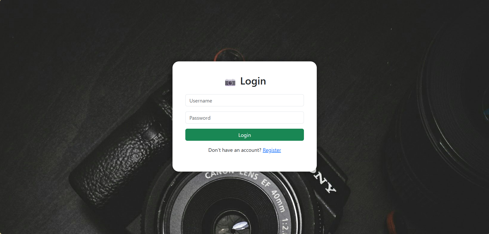
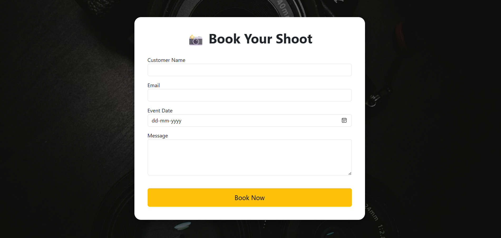
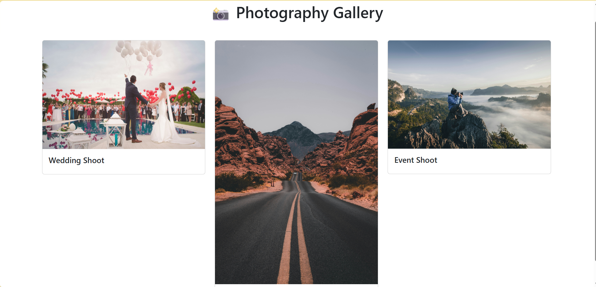

# 📸 PhotoHub

A modern Photography Booking Website built using Django.

---

# 📷 Screenshots

## 🏠 Home Page


---

## 🔐 Login Page



---

## 📅 Booking Page



---

## 🖼️ Gallery Page



---

## 📝 Register Page


---

# 🛠 Technologies Used

- Python
- Django
- HTML
- CSS
- Bootstrap
- SQLite

---

# 🚀 Installation

```bash
git clone https://github.com/abhilashs1423/Photohub.git
cd Photohub

pip install -r requirements.txt

python manage.py migrate

python manage.py runserver
```

---

# 👨‍💻 Author

**Abhilash G S**

GitHub: https://github.com/abhilashs1423